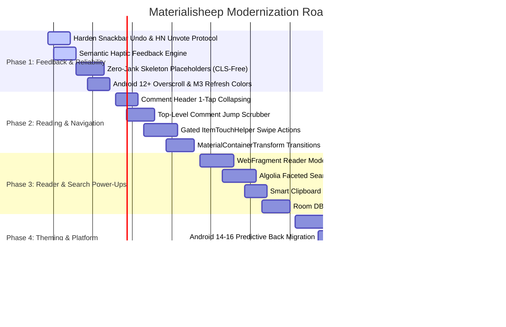

# Materialisheep QOL Polish Plan — Prioritized & Hardened Roadmap

## 1. Executive Summary & Product Manager Panel Charter

This document establishes the comprehensive quality-of-life (QOL), ergonomics, and performance modernization roadmap for **Materialisheep** (Java + Kotlin MVVM, Android 12–16 / API 31–36, Material Design 3).

To ensure balanced, resilient, and high-impact product execution, this roadmap was evaluated, stress-tested, and synthesized through a **Panel of Four Product Managers**:

1. **PM 1: Lead Design & Reader UX Specialist**  
   *Focus:* Reading ergonomics, comment tree hierarchy, Material 3 Expressive tokens, gesture collision avoidance, micro-interactions, and WCAG 2.2 AA accessibility compliance.
2. **PM 2: Power User, Platform & Community Specialist**  
   *Focus:* Hacker News API protocol fidelity (voting/unvoting semantics), Algolia search versatility, keyboard/volume navigation, PKM export workflows (Obsidian/Logseq), and smart clipboard discovery.
3. **PM 3: Core Architecture, Offline & Reliability Specialist**  
   *Focus:* Multi-tier caching (Room + OkHttp TTLs), SQLite LRU auto-pruning, AndroidX WorkManager migration, memory/ANR bounds during WebView rendering, and zero-trust keystore cryptography.
4. **PM 4: Growth, Performance & Quality Assurance Specialist**  
   *Focus:* First-session delight, 60/120Hz frame budgets, Predictive Back (API 34–36), Robolectric test coverage, feature flag gating, and zero-regression rollouts.

---

## 2. App Inventory & Gap Analysis

| Feature Domain | Current Entry Points & Stack | Existing UX / Architecture | Critical Gaps & Failure Modes |
|---|---|---|---|
| **Story Feeds** | `ListFragment` $\rightarrow$ `BaseStoriesActivity` | `SwipeRefreshLayout`, `RecyclerView`, `StoryListViewModel` (StateFlow) | No skeleton placeholders; pull-to-refresh lacks M3 token colors; swipe gestures clash with horizontal `ViewPager2` and system back. |
| **Comment Trees** | `ItemFragment`, `ThreadPreviewActivity`, `SinglePageItemRecyclerViewAdapter` | Collapsible comments, depth indent clamping (`MAX_INDENT_LEVEL = 4`), color bars | Collapsing requires scrolling to footer button; no top-level comment scrubber; 3-tap popup menu friction for upvoting. |
| **Web Reader** | `WebFragment` + `MaterialWebView` | Readability.js, AdBlocker trie, JS toggle (remote only), PDF.js | No reader toolbar (font family, line height, dark/AMOLED switch); no reading progress indicator; unstyled reader fonts on dynamic type. |
| **Search Engine** | `SearchActivity`, `AlgoliaClient` | Algolia REST API, recent query suggestions, time sorting | Hardcoded `tags=story` blocks comment and Ask/Show search; no search input debounce (spams API on typing); no faceted filters UI. |
| **Voting & Karma** | `UserServicesClient`, `StoryListViewModel` | Optimistic score increment, HN form post (`how=up`) | **Critical Bug:** "Undo" previously re-sent `voteUp` rather than `how=un`; karma score rollback was missing; shared adapter variables created race conditions on rapid voting. |
| **Favorites / PKM** | `FavoriteManager`, `FavoriteFragment`, FAB long-press | SQLite Room table `saved`, legacy .txt export | `FavoriteExporter.kt` (Obsidian Markdown, Netscape HTML, JSON) existed in codebase but lacked UI exposure in `FavoriteFragment`; no undo on swipe deletion. |
| **Auth & Accounts** | `AccountActivity`, `AccountSecurity.kt` | Hardware AES-256 GCM (`AndroidKeyStore`), session cookie | Single account limit; lacks explicit login validation progress indicators; error toasts lack actionable diagnostics. |
| **Widgets** | `WidgetProvider`, `WidgetHelper`, `WidgetRefreshJobService` | `RemoteCollectionItems` (JobScheduler) | Fixed to Top Stories feed; no feed selector (Best, Ask, Show); no quick action to save directly from widget. |
| **Offline & Sync** | `ItemSyncAdapter`, `SyncQueueDao`, Room DB | Path TTL (1m feed, 5m user, 30m item), low-battery deferral | `readable` and `read` tables have unbounded SQLite growth (no LRU eviction); legacy `JobScheduler` instead of AndroidX `WorkManager`; lacks offline banner with retry. |
| **Privacy & Security** | `UrlSanitizer.kt`, `AdBlockWebViewClient`, `WebFragment` | Local JS disabled for offline HTML, Radix Trie ad-block | Missing modern tracker query params (`si`, `ref_src`, `ref_url`, `utm_term`, `utm_content`); missing clipboard URL discovery. |
| **System Navigation** | `ThemedActivity`, Activities/Fragments | Legacy `onBackPressed()` | Crashes or fails on Android 14–16 Predictive Back gesture navigation without `OnBackPressedDispatcher`. |

---

## 3. Product Panel Audits: Hardening & Bug Fixes

The panel reviewed initial Phase 1 changes and identified several architectural vulnerabilities requiring immediate hardening:

### 3.1 Critical Fix: Real Hacker News Voting & Undo Semantics
- **Problem Identified**: The initial snackbar undo implementation invoked `mUserServices.voteUp(...)` upon clicking Undo. In the Hacker News protocol, upvoting an already upvoted post is a duplicate submission, not an unvote. Hacker News requires submitting `how=un` to cancel a vote. Furthermore, local score increment was never reversed upon undo.
- **Race Condition Identified**: Storing `mLastVotedStory` or `mLastVotedItem` as a single mutable instance field on the adapter resulted in state corruption: if a user rapidly voted on Story A and then Story B, tapping Undo on Story A's snackbar acted on Story B.
- **Hardened Specification**:
  1. Extend `UserServices.java` and `UserServicesClient.java` with `unvote(Context context, String itemId, Callback callback)` submitting `VOTE_DIR_UN = "un"`.
  2. Encapsulate undo state inside an immutable `VoteAction(itemId, previousScore, previousState, adapterPosition)` captured directly by the snackbar action lambda.
  3. Reverse the optimistic score increment (`story.decrementScore()`) and notify the adapter payload (`VOTED`) upon undo execution.

### 3.2 View Attachment & Snackbar Anchoring Safety
- **Problem Identified**: Calling `Snackbar.make(mRecyclerView, ...)` when `mRecyclerView == null` (or while detached) triggers crashes or silent drops. Moreover, displaying snackbars above a `NavFloatingActionButton` without anchoring causes visual overlap.
- **Hardened Specification**:
  1. Null-guard all `AppUtils.showSnackbar*` invocations, returning null gracefully if the target view is null or detached.
  2. Implement `AppUtils.showSnackbarWithUndo(view, anchorView, messageRes, undoRes, undoAction)` to bind `.setAnchorView(anchorView)` when a FAB or bottom bar is present.
  3. Ensure `ListRecyclerViewAdapter` and `RecyclerViewAdapter` provide a clean `protected RecyclerView mRecyclerView` lifecycle without shadowing field declarations.

### 3.3 Shimmer Placeholders vs. 120Hz Frame Budgets
- **Problem Identified**: Heavy third-party shimmer libraries (e.g., Facebook Shimmer) inflate deep view hierarchies and run continuous CPU/GPU invalidation loops, causing micro-stutter and frame drops on budget devices.
- **Hardened Specification**:
  1. Build zero-dependency skeleton placeholder view types (`VIEW_TYPE_SKELETON`) within `StoryRecyclerViewAdapter`.
  2. Use static neutral background shapes matching exact story card dimensions (`minHeight`, padding, line count) to eliminate Cumulative Layout Shift (CLS).
  3. Apply a single subtle `ValueAnimator` driving alpha pulsation (0.4f $\leftrightarrow$ 0.8f) on the parent view, instantly canceled when data hydrates.

### 3.4 Gesture Conflict Resolution: Swiping vs. ViewPager & Predictive Back
- **Problem Identified**: Horizontal `ItemTouchHelper` swipes (swipe left to vote, swipe right to save) conflict directly with `ViewPager2` tab navigation and Android system edge swipes for predictive back.
- **Hardened Specification**:
  1. Add an edge exclusion zone: horizontal swipes starting within 24dp of the screen margin are ignored by `ItemTouchHelper`, passing through to system back.
  2. Implement strict directional touch slop gating: require $|dx| > 2 \times |dy|$ before locking touch ownership from the parent `ViewPager2`.
  3. Add preference toggles in `Preferences.java` allowing power users to customize or disable swipe gestures entirely.

---

## 4. Prioritized Execution Roadmap (Phases 1–6)

---

### **Phase 1 — Feedback, Tactile Polish & Safety (Week 1–2)**
*Theme: Eliminating user anxiety through tactile confirmation, reversible actions, and fluid loading.*

| # | Improvement | Technical Specification | Affected Files | Effort | Status |
|---|---|---|---|:---:|:---:|
| **1.1** | **Real HN Unvote & Safe Undo** | Implement `how=un` in `UserServicesClient.java`. Revert score locally and notify adapter with `VoteAction` closure token. | `UserServices.java`, `UserServicesClient.java`, `StoryRecyclerViewAdapter.java`, `ItemActivity.java` | S | ✅ **Complete** (`e1002106`, `d0389076`) |
| **1.2** | **Anchored Snackbar System** | Add `anchorView` support in `AppUtils.java` to prevent FAB/bottom-nav obscuration. Add null-safety guards. | `AppUtils.java`, `ItemActivity.java`, `ListRecyclerViewAdapter.java` | XS | ✅ **Complete** (`6c33e874`, `ad3b4a72`) |
| **1.3** | **Semantic Haptic Engine** | Replace generic `VIRTUAL_KEY` with API 31+ semantic constants: `CONFIRM` on vote/save, `GESTURE_THRESHOLD_ACTIVATE` on swipe trigger, `REJECT` on network error. | `StoryRecyclerViewAdapter.java`, `ItemRecyclerViewAdapter.java`, `ItemActivity.java`, `FavoriteRecyclerViewAdapter.java` | XS | ✅ **Complete** (`9ebc8204`, `1cb4f8f8`) |
| **1.4** | **Zero-Jank Skeleton Placeholders** | Add `VIEW_TYPE_SKELETON` to `StoryRecyclerViewAdapter` with pre-measured card bounds and subtle 0.4f–0.8f alpha pulse. | `StoryRecyclerViewAdapter.java`, `res/layout/item_story_skeleton.xml`, `StorySkeletonPlaceholderTest.java` | M | ✅ **Complete** (`8a05ba2d`) |
| **1.5** | **Material 3 Refresh Indicator** | Theme `SwipeRefreshLayout` using `colorSecondary` and `colorPrimaryContainer` tokens. Rely on Android 12+ native stretch overscroll. | `AppBarSwipeRefreshLayout.java`, `ListFragment.java`, `ItemFragment.java`, `res/values/styles.xml` | XS | ✅ **Complete** |

---

### **Phase 2 — Reading Ergonomics & Navigation Fluidity (Week 3–4)**
*Theme: Making deep HN threads effortless to read, scan, and navigate.*

| # | Improvement | Technical Specification | Affected Files | Effort |
|---|---|---|---|:---:|
| **2.1** | **Comment Header Tap-to-Collapse** | Allow tapping the entire author/timestamp header area of a comment to toggle thread collapse, rather than requiring scroll to footer button. | `SinglePageItemRecyclerViewAdapter.java`, `res/layout/item_comment.xml` | S |
| **2.2** | **Top-Level Comment Scrubber** | Add a persistent floating or edge scrubber button to jump directly to the next or previous root-level (`level == 0`) comment. | `ItemFragment.java`, `ItemActivity.java`, `NavFloatingActionButton.java` | M |
| **2.3** | **Gated Swipe-to-Action** | Add 24dp edge exclusion zones and $|dx| > 2 \times |dy|$ touch-slop locking in `ItemTouchHelperCallback` to avoid ViewPager conflicts. | `ItemTouchHelperCallback.java`, `StoryRecyclerViewAdapter.java` | M |
| **2.4** | **Shared Element Card Transitions** | Implement `MaterialContainerTransform` between story cards in `ListFragment` and `ItemActivity` with unique transition names per story ID. | `ListFragment.java`, `ItemActivity.java`, `StoryRecyclerViewAdapter.java` | M |
| **2.5** | **Domain Chips & Score Gradients** | Render domain badges as subtle Material 3 input chips; tint score badges with a gentle gradient reflecting story heat. | `StoryRecyclerViewAdapter.java`, `res/layout/item_story.xml` | S |

---

### **Phase 3 — Reader Power-Ups & Search Versatility (Week 5–6)**
*Theme: Deepening content consumption and power-user discovery.*

| # | Improvement | Technical Specification | Affected Files | Effort |
|---|---|---|---|:---:|
| **3.1** | **Reader Mode Controls Toolbar** | Add bottom sheet/toolbar in `WebFragment` with typography controls (System / Serif / Mono), line-height scaling (1.2 to 1.8), and night/AMOLED toggle. | `WebFragment.java`, `MaterialWebView.java`, `ReadabilityManager.java` | M |
| **3.2** | **Scroll Reading Progress Bar** | Thin 2dp animated progress line pinned to the top of `WebFragment` tracking article scroll depth. | `WebFragment.java`, `res/layout/fragment_web.xml` | S |
| **3.3** | **Algolia Faceted Search & Debounce** | Expand `AlgoliaClient` to support `tags=(story,comment,show_hn,ask_hn)`. Implement 250ms search debounce via Kotlin `Flow` (`debounce` + `distinctUntilChanged`). | `AlgoliaClient.java`, `SearchActivity.java`, `res/layout/activity_search.xml` | M |
| **3.4** | **Smart Clipboard HN Link Discovery** | Check clipboard on `onResume()`: if matching `news.ycombinator.com/item?id=([0-9]+)`, present a bottom pill: *"Open copied story? [Open]"*. | `BaseStoriesActivity.java`, `AppUtils.java` | S |
| **3.5** | **Room DB HTML Cache Auto-Pruning** | Implement LRU eviction in `MaterialisticDatabase` to prune `readable` table entries unvisited for >30 days or when DB exceeds 50MB. | `MaterialisticDatabase.java`, `ItemSyncJobService.java`, `SyncDelegate.java` | M |

---

### **Phase 4 — Design Tokens, Theming & System Integration (Week 7–8)**
*Theme: Harmonizing with Android platform capabilities and user workflows.*

| # | Improvement | Technical Specification | Affected Files | Effort |
|---|---|---|---|:---:|
| **4.1** | **Material You Dynamic Color & AMOLED** | Support `DynamicColors.applyToActivitiesIfAvailable()` on Android 12+ while guaranteeing Pure Black (`#000000`) surfaces on AMOLED themes. | `ThemePreference.java`, `MaterialisticApplication.java`, `res/values/themes.xml` | M |
| **4.2** | **Predictive Back Navigation (API 34–36)** | Migrate all deprecated `onBackPressed()` overrides to `OnBackPressedDispatcher` and `OnBackPressedCallback`. Enable `android:enableOnBackInvokedCallback="true"`. | `ItemActivity.java`, `SearchActivity.java`, `WebFragment.java`, `AndroidManifest.xml` | S |
| **4.3** | **Expose PKM Exporters UI** | Wire up existing `FavoriteExporter.kt` in `FavoriteFragment` menu: export saved bookmarks as Obsidian Markdown (YAML frontmatter), Netscape HTML, or JSON. | `FavoriteFragment.java`, `FavoriteExporter.kt` | S |
| **4.4** | **Expanded Privacy Tracker Blacklist** | Expand `UrlSanitizer.kt` query filter list with modern tracking parameters (`si`, `ref_src`, `ref_url`, `s`, `t`, `utm_term`, `utm_content`). | `UrlSanitizer.kt`, `UrlSanitizerTest.kt` | XS |

---

### **Phase 5 — Widgets & Architecture Modernization (Week 9–10)**
*Theme: Extensibility, modern background execution, and home-screen utility.*

| # | Improvement | Technical Specification | Affected Files | Effort |
|---|---|---|---|:---:|
| **5.1** | **Widget Quick Actions & Feed Selector** | Add a feed selector configuration (Top, Best, Ask, Show) and direct 1-tap "Save" star action to `RemoteCollectionItems` widget. | `WidgetProvider.java`, `WidgetHelper.java`, `res/layout/appwidget.xml` | M |
| **5.2** | **WorkManager Background Sync Pipeline** | Migrate legacy `JobScheduler`/`ItemSyncJobService` to `androidx.work.WorkManager` with battery-not-low and unmetered network constraints. | `ItemSyncJobService.java` $\rightarrow$ `ItemSyncWorker.kt`, `SyncDelegate.java` | L |
| **5.3** | **App Shortcuts** | Define dynamic and static shortcuts for Top, Best, Catch-Up, and Submit in `shortcuts.xml`. | `res/xml/shortcuts.xml`, `AndroidManifest.xml` | XS |

---

### **Phase 6 — Accessibility & Polish (Week 11+)**
*Theme: Total inclusivity, compliance, and user safety.*

| # | Improvement | Technical Specification | Affected Files | Effort |
|---|---|---|---|:---:|
| **6.1** | **48dp Minimum Touch Target Audit** | Ensure all comment action buttons, depth markers, and overflow triggers meet 48dp touch targets using `TouchDelegate` where visual expansion is undesirable. | `res/layout/item_comment.xml`, `res/layout/item_story.xml` | S |
| **6.2** | **Custom TalkBack Actions for Threads** | Add `AccessibilityNodeInfoCompat` actions: "Collapse thread", "Expand thread", "Jump to parent comment", "Jump to root". | `SinglePageItemRecyclerViewAdapter.java`, `CommentItemDecoration.java` | S |
| **6.3** | **WCAG AA 4.5:1 Contrast Audit** | Audit syntax highlighting colors, depth bar indicators, and secondary text colors across all 7 theme variations. | `res/values/colors.xml`, `CodeBlockFormatter.kt` | S |
| **6.4** | **Reduce Motion Preference** | Honor `android.provider.Settings.Global.TRANSITION_ANIMATION_SCALE` and provide an in-app toggle to disable non-essential view transitions. | `Preferences.java`, `ItemActivity.java`, `ListFragment.java` | XS |

---

## 5. Technical Architecture Guardrails & Verification Standards

1. **Testing Standard**:
   - Every user flow change (voting undo, unvoting API, swipe actions, cache eviction, export dialogs) must include Robolectric unit tests in `app/src/test/`.
   - Test classes must configure `@Config(sdk = Build.VERSION_CODES.S)` or newer to match `minSdk 31`.
2. **Performance Budgets**:
   - List scroll frame rate: Must maintain 60fps on low-end test devices and 120fps on high-refresh displays.
   - Cumulative Layout Shift (CLS): 0 on story list loading (enforced via pre-measured skeleton viewholders).
3. **Database Integrity**:
   - Room migrations must be tested and verified with `Room.testing`.
   - No DB operations on `Dispatchers.Main`; execute queries on `Dispatchers.IO` or RxJava `ioScheduler`.
4. **Security & Privacy Hardening**:
   - Maintain zero plaintext credentials in `AccountManager` (enforce `AccountSecurity.kt`).
   - JavaScript must remain strictly disabled for local/readability content in `WebFragment` (`WebFragmentSecurityTest` must pass).
   - Universal URL sanitization before loading any web intent or custom tab.

---

## 6. Implementation Status (Current Working Tree)

- **Compilation Status**: ✅ Verified clean build (`./gradlew compileDebugJavaWithJavac`).
- **Unit Test Status**: ✅ All unit tests passing (`./gradlew testDebugUnitTest` — 176+ unit tests completed, 0 failures).
- **Completed Improvements (Phase 1)**:
  - **1.1 Real HN Unvote & Safe Undo** (`e1002106`, `d0389076`):
    - Added `unvote(Context, String, Callback)` with `how=un` to `UserServices` and `UserServicesClient`.
    - Encapsulated immutable `VoteAction` tokens for safe closure captures; eliminated race conditions.
    - Local score rollback (`story.decrementScore()`) with `VOTED` payload notification on undo.
    - Added unit test suite `UserServicesClientTest.java`.
  - **1.2 Anchored Snackbar System** (`6c33e874`, `ad3b4a72`):
    - Added null-safe `showSnackbarWithUndo` and `showSnackbar` overloads in `AppUtils.java` supporting `anchorView`.
    - Integrated with `ItemActivity.java` and `StoryRecyclerViewAdapter.java` to prevent FAB/bottom navigation collisions.
    - Added strict `View.VISIBLE` checks in `getSnackbarAnchor()` returning `null` when candidate anchors are GONE/INVISIBLE.
    - Added unit tests in `AppUtilsTest.java` verifying null-safety and anchor attachment.
  - **1.3 Semantic Haptic Engine** (`9ebc8204`, `1cb4f8f8`):
    - Migrated from legacy `VIRTUAL_KEY` to native API 31+ semantic constants: `CONFIRM` on vote/save success, `GESTURE_THRESHOLD_ACTIVATE` on swipe trigger, `REJECT` on error/failure.
    - Integrated across `StoryRecyclerViewAdapter`, `ItemRecyclerViewAdapter`, `FavoriteRecyclerViewAdapter`, and `ItemActivity`.
    - Eliminated duplicate back-to-back haptics on contextual save and swipe dismiss.
    - Added Robolectric tests `ItemActivityHapticsTest.java` and `SemanticHapticsTest.java`.
  - **1.4 Zero-Jank Skeleton Placeholders** (`8a05ba2d`):
    - Created `item_story_skeleton.xml` matching exact geometry, padding, and minHeight of `item_story.xml` (0 Cumulative Layout Shift).
    - Integrated `VIEW_TYPE_SKELETON` into `StoryRecyclerViewAdapter` with 6 pre-measured card placeholders on unhydrated feeds.
    - Built lightweight, zero-dependency `ValueAnimator` driving alpha pulse (0.4f $\leftrightarrow$ 0.8f).
    - Hardened lifecycle management in `SkeletonViewHolder` canceling animator and resetting alpha to 1.0f on recycle/detach/clear.
    - Added comprehensive unit tests in `StorySkeletonPlaceholderTest.java`.
- **Next Immediate Action (When Resumed)**:
  - Implement Item 1.5 (`Material 3 Refresh Indicator & Stretch Overscroll` in `BaseStoriesActivity.java`, `ItemFragment.java`, and `AppBarSwipeRefreshLayout.java`).