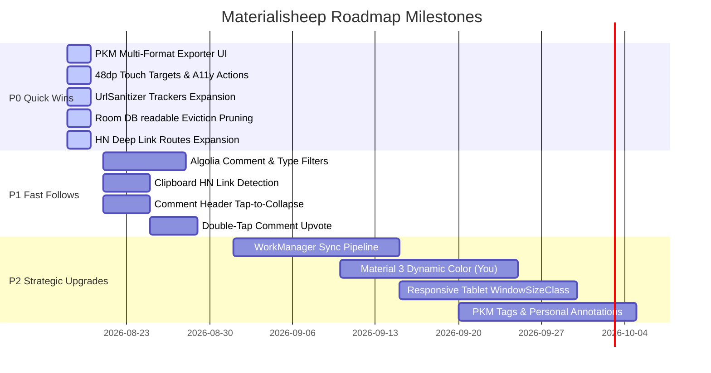

# Materialisheep: Tri-Perspective Product Management Review & Strategy Document

**Document Version:** 1.0.0  
**Date:** 2026-08-18  
**Repository:** `xRahul/materialisheep` (Fork of `sheepdestroyer/materialisheep`)  
**Target Environment:** Android 12+ (minSdk 31, targetSdk/compileSdk 36, Java 21, Kotlin 2.3)

---

## 1. Executive Summary

Materialisheep is an open-source, high-performance Android Hacker News client designed for fast, distraction-free reading, offline resilience, and deep customizability.

To guide the next generation of product improvements, a comprehensive product review was conducted through **three distinct Product Management lenses**:
1. **Reader UX, Design Systems & Accessibility Specialist (PM 1):** Focuses on story & comment reading ergonomics, Material 3 design tokens, surgical edge-to-edge system insets, responsive large-screen/foldable layouts, and WCAG AA accessibility compliance.
2. **Power User, Community & Engagement Specialist (PM 2):** Focuses on HN account identity, comment authoring/preview, search versatility (Algolia filtering & comment search), Personal Knowledge Management (PKM export to Obsidian/Logseq), and widgets/shortcuts.
3. **Technical Product, Offline Reliability & Performance Specialist (PM 3):** Focuses on multi-tiered caching, offline sync reliability, Room DB lifecycle/storage management, background job constraints, privacy/tracker sanitization, and runtime performance.

This document compiles their findings, catalogs existing strengths, identifies critical feature and architecture gaps, and defines a prioritized execution roadmap.

---

## 2. Product Pillar Audits

### Pillar 1: Reader UX, Design Systems & Accessibility (PM 1)

#### Strengths
- **Dual Story Browsing Modes:** Smooth switching between Card View and Flat/Compact list layouts with auto-mark-as-read on scroll.
- **Deep Collapsible Comment Trees:** Single-page collapsible comment hierarchy with visual multi-level depth bars (`CommentItemDecoration.java`) and indentation clamping (`MAX_INDENT_LEVEL = 4`) preventing text squishing.
- **Fast Tree Traversal:** Depth bar click to jump to immediate parent; long-press to jump directly to thread root. Isolated thread ancestry preview via `ThreadPreviewActivity.kt`.
- **Author Badging & Syntax Highlighting:** Visual `[OP]` and `[YOU]` badging on comments; `<pre><code>` block container formatting with keyword highlighting (`CodeBlockFormatter.kt`).
- **Power Ergonomics:** Freely draggable `NavFloatingActionButton` with persistent coordinates and 4-way fling gestures; hardware volume key navigation (`KeyDelegate.java`).
- **Theme Diversity:** 7 built-in themes including Pure Black AMOLED (`#000000`), Sepia, Solarized Dark/Light, and Teal Green.

#### Gaps & Opportunities
- **Touch Target Sizing (< 48dp):** Comment overflow menu button (`button_more`) was sized at 36dp and depth bar touch hit-box was 4dp, violating Android accessibility guidelines.
- **TalkBack Semantics:** Comment cards lacked custom accessibility actions for toggling collapse state and jumping to parent comments.
- **Contrast Ratios:** Static cyan syntax colors and yellow depth markers dropped below WCAG AA 4.5:1 on light/sepia themes.
- **Edge-to-Edge Insets:** Blunt whole-window padding in `ThemedActivity` prevents content from scrolling seamlessly behind translucent system bars.
- **Large Screen / Foldable Layouts:** Dual-pane layout restricted to fixed `w820dp-land` (landscape only), failing tablets and foldables held in portrait mode.
- **Comment Collapse Ergonomics:** Collapsing required scrolling to the bottom toggle button rather than tapping the comment header.

---

### Pillar 2: Power User, Community & Engagement (PM 2)

#### Strengths
- **Zero-Trust Credential Security:** Hardware-backed `AndroidKeyStore` AES-256 GCM encryption (`AccountSecurity.kt`); no plaintext passwords in `AccountManager`.
- **Submission Extraction:** Headless webpage title retrieval and regex URL extraction during story submission (`SubmitActivity.java`).
- **Draft Safety:** Automatic draft preservation on exit with save/discard prompts (`ComposeActivity.java`).
- **Algolia Search Engine:** Integration with Algolia Hacker News API supporting Popular and Recent sorting across multiple timeframes.
- **Optimistic UI Feedback:** Immediate score increment and button tinting on upvote before network resolution.
- **Modern App Widgets:** `RemoteCollectionItems` home-screen widget with scheduled background refreshes.

#### Gaps & Opportunities
- **Dead-Code PKM Exporters:** `FavoriteExporter.kt` implemented Obsidian/Logseq Markdown, Netscape HTML, and JSON exports, but `FavoriteFragment` only exposed legacy plain `.txt` export.
- **Hardcoded Search Tags:** `AlgoliaClient.java` hardcoded `tags=story`, preventing users from searching comments, "Ask HN", or "Show HN".
- **Comment Voting Friction:** Upvoting comments required a 3-tap popup menu workflow.
- **Clipboard Discovery:** No automatic detection of copied HN URLs (`news.ycombinator.com/item?id=...`) on app resume.
- **Deep Link Gaps:** `AndroidManifest.xml` lacked filters for standard HN paths (`/newest`, `/best`, `/ask`, `/show`, `/jobs`, `/threads`).
- **Single Account Limit:** No multi-account switching for users with separate work and personal personas.

---

### Pillar 3: Technical Product, Offline Reliability & Performance (PM 3)

#### Strengths
- **Multi-Tiered Cache Architecture:** Room DB (`saved`, `read`, `readable`, `sync_queue`) combined with 20MB OkHttp cache and path-aware TTL interceptors (1-min feeds, 5-min users, 30-min items) with error shielding.
- **Battery-Aware Offline Prefetch:** `SyncDelegate.java` prefetches stories, comments, and readability HTML while deferring to `SyncQueueDao` when battery is low or on cellular data.
- **Parallel Network Hydration:** Two-phase story hydration with concurrency capped at 8 and batched SQL `IN` queries (`SessionManager.isViewed`, `FavoriteManager.check`) eliminating N+1 query overhead.
- **Universal Privacy & Ad-Blocking:** Local tracker stripping in `UrlSanitizer.kt`, Radix Trie ad/tracker blocking (`AdBlocker.java`), and local content JavaScript sandboxing in `WebFragment.java`.
- **State Preservation on Failure:** `StoryListViewModel.kt` preserves cached story lists during pull-to-refresh network failures without screen blanking.

#### Gaps & Opportunities
- **Unbounded Room DB Storage:** The `readable` and `read` tables lacked eviction policies, leading to continuous database growth over months of reading.
- **Background Headless WebView Hazards:** Instantiating `CacheableWebView` in background sync services risks ANRs and memory pressure on Android 12-15.
- **Tracker Blacklist Coverage:** `UrlSanitizer.kt` missed modern tracking parameters (`s`, `t`, `ref_src`, `ref_url`, `si`, `feature`, `utm_term`, `utm_content`).
- **Sync Queue Retry Policies:** `SyncQueueEntry` lacked attempt counts and exponential backoff metadata for handling dead URLs.
- **Sync Modernization:** Background syncing relies on legacy `JobScheduler` / `SyncAdapter` rather than unified AndroidX `WorkManager`.

---

## 3. Prioritized Product Roadmap

### Action Matrix

| Priority | Feature / Gap | Pillar | Effort | Impact | Status |
|---|---|---|---|---|---|
| **P0** | **Hook Up PKM Multi-Format Exporters** (Obsidian Markdown, HTML, JSON) | Power User | Low | High | In Progress |
| **P0** | **Enforce 48dp Touch Targets** on Comment Controls & Level hit box | UX / A11y | Low | High | In Progress |
| **P0** | **TalkBack Accessibility Actions** for comment tree depth & collapse | UX / A11y | Low | High | In Progress |
| **P0** | **Room DB `readable` HTML Cache Auto-Pruning** | Tech / Reliability | Low | High | In Progress |
| **P0** | **Expand `UrlSanitizer.kt` Privacy Tracker Blacklist** | Tech / Privacy | Low | Medium | In Progress |
| **P0** | **Expand `AndroidManifest.xml` Deep Link Routes** | Power User | Low | Medium | In Progress |
| **P1** | **Clipboard HN Item Link Detection on Resume** | Power User | Low | High | Planned |
| **P1** | **Comment Header Tap-to-Collapse** | Reader UX | Low | High | In Progress |
| **P1** | **Dynamic Theme-Aware Syntax Highlighting Colors** | Reader UX / A11y | Low | Medium | In Progress |
| **P1** | **Dynamic Algolia Query Filters (Search Comments, Ask, Show)** | Power User | Med | High | Planned |
| **P1** | **Sync Queue Retry Limits & Exponential Backoff** | Tech / Reliability | Low | Medium | Planned |
| **P2** | **Migrate Sync Stack to AndroidX WorkManager** | Architecture | Med | High | Backlog |
| **P2** | **Material 3 (M3) DayNight & Dynamic Color Engine** | Design System | High | Medium | Backlog |
| **P2** | **Responsive Tablet & Foldable Multi-Pane Layouts** | Large Screen | Med | High | Backlog |
| **P2** | **PKM 2.0: Bookmark Tags, Notes & FTS5 Search** | Power User | Med | High | Backlog |

---

## 4. Maintenance & Review Cadence
- This document serves as the living product roadmap for `xRahul/materialisheep`.
- Review quarterly or upon major Android SDK/Material Design specification releases.
