# Materialisheep Strategic Engineering Roadmap, Issue Taxonomy & Technical Architecture

This document provides a deep-dive, restructured analysis of the `materialisheep` codebase. It cleanly separates **Existing System & Architectural Improvements** from **New Product Features**, establishing a strict execution sequence based on technical dependencies, performance impact, and stability risks.

---

## Strategic Phasing & Execution Order

```mermaid
flowchart TD
    subgraph Phase1["PHASE 1: Critical Reliability, Memory & Tooling (DO FIRST - P0)"]
        A1["ARCH-09: WebView Native Memory Leak"]
        A2["ARCH-10: Thread-Unsafe LiveData DB Bus"]
        A3["ARCH-15: FontCache Uncaught Crash"]
        A4["ARCH-16: Unscoped Rx Subscriptions"]
        D1["DEP-01: Gradle Version Catalog"]
    end

    subgraph Phase2["PHASE 2: Data Layer, Concurrency & Security Modernization (DO SECOND - P1)"]
        A5["ARCH-11: Encrypted Keystore Auth Cookie"]
        A6["ARCH-12: Granular Network Cache-Control"]
        A7["ARCH-13: In-Memory LruCache"]
        A8["ARCH-04: DataStore Preferences Migration"]
        A9["ARCH-03: Coroutines/Flow Data Layer"]
        A10["ARCH-06: PrecomputedText & ListAdapter"]
        A11["ARCH-05: WorkManager Sync Migration"]
        A12["ARCH-14: Modern Custom Tabs APIs"]
    end

    subgraph Phase3["PHASE 3: Core Product Features & UX Upgrades (DO THIRD - P1/P2)"]
        F1["FEAT-07: Pure Black OLED Theme"]
        F2["FEAT-01: Content Filter & Muting Engine"]
        F3["FEAT-03: Algolia Search Filter Chips"]
        F4["FEAT-05: WorkManager Reply Alerts"]
        F5["FEAT-04: Power-User Comment Gestures"]
        F6["FEAT-06: Rich Previews & Syntax Highlighting"]
        F7["FEAT-08: Offline Storage Manager"]
    end

    subgraph Phase4["PHASE 4: Jetpack Compose, AI & Modularization (DO LAST - P2/P3)"]
        A13["ARCH-01: Full Kotlin Migration"]
        A14["ARCH-02: Jetpack Compose Phased UI"]
        D2["DEP-02: kotlinx.serialization"]
        D3["DEP-03: Dagger to Hilt Migration"]
        F8["FEAT-02: AI Article/Comment Summarizer"]
        A15["ARCH-07: Multi-Module Architecture"]
        A16["ARCH-08: Roborazzi Screenshot Tests"]
        D4["DEP-04: AndroidX Baseline Profiles"]
    end

    Phase1 --> Phase2
    Phase2 --> Phase3
    Phase3 --> Phase4
```

### Why This Sequence?
1. **Phase 1 (Foundations & Fixes First):** Resolves native memory leaks, unhandled crashes, and thread-safety bugs that corrupt state. Centralizes dependencies into `libs.versions.toml` so subsequent refactoring uses clean version-catalog aliases.
2. **Phase 2 (Architecture Modernization Second):** Establishes the coroutine repository, reactive DataStore, in-memory caching, and encrypted authentication. All new features in Phase 3 directly depend on these modern data and background pipelines.
3. **Phase 3 (New Features Third):** Introduces user-facing features (muting, background reply notifications, search chips, AMOLED theme) on top of the robust, non-blocking Phase 2 architecture.
4. **Phase 4 (Advanced Modernization Last):** Large-scale architectural shifts (Jetpack Compose migration, Multi-module splitting, Hilt DI, AI Summarization) that require a completely stable, bug-free core.

---

## Part I: Existing System Improvements, Bug Fixes & Architecture Modernization

### [ARCH-09] WebView Lifecycle & Native Memory Leak in `WebFragment`
- **Category:** `Memory Management / Reliability`
- **Execution Order:** `Phase 1 (Do First - P0)`
- **Impacted Files:** [`WebFragment.java`](file:///home/rahul/projects/materialisheep/app/src/main/java/io/github/sheepdestroyer/materialisheep/WebFragment.java#L251-L260)
- **Deep-Dive Root Cause:**
  `mWebView.destroy()` is executed in `onDestroy()` rather than `onDestroyView()`. In ViewPager2 / Fragment transactions, when tabs switch, `onDestroyView()` is invoked to destroy the view hierarchy, but the fragment instance is retained in memory. The retained `mWebView` instance holds strong references to the old `Context`, native Chromium `WebContents`, GPU composition surfaces, and hardware render nodes, causing multi-megabyte native memory leaks on every tab switch.
- **Actionable Blueprint:**
  1. In `onDestroyView()`, remove `mWebView` from its parent `ViewGroup` via `((ViewGroup) mWebView.getParent()).removeView(mWebView)`.
  2. Clear webview listeners, load `about:blank`, and call `mWebView.destroy()`.
  3. Nullify view binding and webview references.

---

### [ARCH-10] Lossy & Thread-Unsafe LiveData Database Event Bus in `MaterialisticDatabase`
- **Category:** `Concurrency / State Management`
- **Execution Order:** `Phase 1 (Do First - P0)`
- **Impacted Files:** [`MaterialisticDatabase.java`](file:///home/rahul/projects/materialisheep/app/src/main/java/io/github/sheepdestroyer/materialisheep/data/MaterialisticDatabase.java#L131-L135)
- **Deep-Dive Root Cause:**
  `setLiveValue(Uri uri)` invokes `mLiveData.setValue(uri)` followed immediately by `mLiveData.setValue(null)`. When called from background DAO or sync worker threads, `setValue()` crashes the app with `IllegalStateException: Cannot invoke setValue on a background thread`. Furthermore, because `LiveData` is lossy when values are posted rapidly in succession, intermediate database update events are dropped before UI observers receive them.
- **Actionable Blueprint:**
  1. Replace `MutableLiveData<Uri>` with Kotlin `MutableSharedFlow<Uri>` with `replay = 0`, `extraBufferCapacity = 64`, and `onBufferOverflow = BufferOverflow.DROP_OLDEST`.
  2. Expose thread-safe emission method `tryEmit(uri)` runnable from any dispatcher.

---

### [ARCH-15] Uncaught Exception Crash Risk in `FontCache.java`
- **Category:** `Reliability / Crash Prevention`
- **Execution Order:** `Phase 1 (Do First - P0)`
- **Impacted Files:** [`FontCache.java`](file:///home/rahul/projects/materialisheep/app/src/main/java/io/github/sheepdestroyer/materialisheep/FontCache.java#L63)
- **Deep-Dive Root Cause:**
  `FontCache.get()` delegates to `mTypefaceMap.computeIfAbsent(typefaceName, name -> Typeface.createFromAsset(context.getAssets(), name))`. If an asset font is missing, corrupted, or unsupported, `createFromAsset` throws an unchecked `RuntimeException` that escapes `computeIfAbsent` and crashes the main UI thread during layout inflation.
- **Actionable Blueprint:**
  1. Wrap `createFromAsset` inside a `try-catch (RuntimeException)` block returning `Typeface.DEFAULT` on failure.
  2. Migrate bundled fonts to Android standard `res/font/` XML font families via `ResourcesCompat.getFont(context, resId)`.

---

### [ARCH-16] Unscoped Fire-and-Forget RxJava Subscriptions in `SessionManager.kt`
- **Category:** `Concurrency / Resource Management`
- **Execution Order:** `Phase 1 (Do First - P0)`
- **Impacted Files:** [`SessionManager.kt`](file:///home/rahul/projects/materialisheep/app/src/main/java/io/github/sheepdestroyer/materialisheep/data/SessionManager.kt#L75-L79)
- **Deep-Dive Root Cause:**
  `SessionManager.view(itemId)` runs an `@SuppressLint("CheckResult")` uncaptured RxJava subscription without lifecycle management. If multiple items are marked as viewed concurrently, runaway threads are spawned without backpressure or cancellation.
- **Actionable Blueprint:**
  1. Convert `view(itemId)` to a `suspend fun` or launch it inside a dedicated application-scoped `CoroutineScope(SupervisorJob() + Dispatchers.IO)`.

---

### [DEP-01] Centralize Dependencies with Gradle Version Catalog (`libs.versions.toml`)
- **Category:** `Build System / Tooling`
- **Execution Order:** `Phase 1 (Do First - P0)`
- **Impacted Files:** [`build.gradle`](file:///home/rahul/projects/materialisheep/build.gradle), [`app/build.gradle`](file:///home/rahul/projects/materialisheep/app/build.gradle)
- **Deep-Dive Root Cause:**
  Dependencies are declared using fragmented string literals and `ext` blocks across root and app `build.gradle` files. This prevents automated dependency update tooling (Renovate/Dependabot), lacks type-safety, and hinders future multi-module build optimization.
- **Actionable Blueprint:**
  1. Create `gradle/libs.versions.toml` defining versions, libraries, and plugin bundles.
  2. Refactor `app/build.gradle` to use `libs.*` accessors.

---

### [ARCH-11] Plaintext Password Storage in `AccountManager` & Zero-Trust Session Security
- **Status:** `[RESOLVED]` (Implemented `AccountSecurity.kt` with AndroidKeyStore AES-256 GCM encryption; verified with `AccountSecurityTest`)
- **Category:** `Security / Credential Hygiene`
- **Execution Order:** `Phase 2 (Do Second - P1)`
- **Impacted Files:** [`AccountSecurity.kt`](file:///home/rahul/projects/materialisheep/app/src/main/java/io/github/sheepdestroyer/materialisheep/accounts/AccountSecurity.kt), [`LoginActivity.java`](file:///home/rahul/projects/materialisheep/app/src/main/java/io/github/sheepdestroyer/materialisheep/LoginActivity.java#L150), [`AppUtils.java`](file:///home/rahul/projects/materialisheep/app/src/main/java/io/github/sheepdestroyer/materialisheep/AppUtils.java#L454)
- **Deep-Dive Root Cause:**
  `LoginActivity.addAccount` previously stored plaintext account passwords in system AccountManager.
- **Resolution:**
  1. Built `AccountSecurity.kt` providing hardware-backed Keystore AES-256 GCM encryption.
  2. Updated `LoginActivity` to pass `null` to `AccountManager` and store encrypted credentials via `AccountSecurity`.
  3. Added auto-migration and redaction of legacy plaintext passwords in `AppUtils.getCredentials()`.

---

### [ARCH-12] Coarse 30-Minute Network Cache Overrides in `NetworkModule`
- **Status:** `[RESOLVED]` (Implemented granular path routing in `CacheOverrideNetworkInterceptor` with error shielding; verified with `NetworkModuleTest`)
- **Category:** `Networking / Caching Strategy`
- **Execution Order:** `Phase 2 (Do Second - P1)`
- **Impacted Files:** [`NetworkModule.java`](file:///home/rahul/projects/materialisheep/app/src/main/java/io/github/sheepdestroyer/materialisheep/NetworkModule.java#L165-L200), [`RestServiceFactory.java`](file:///home/rahul/projects/materialisheep/app/src/main/java/io/github/sheepdestroyer/materialisheep/data/RestServiceFactory.java)
- **Deep-Dive Root Cause:**
  `CacheOverrideNetworkInterceptor` previously cached all responses indiscriminately for 30 minutes.
- **Resolution:**
  1. Feed index endpoints (`/v0/*stories.json`, `updates.json`, Algolia `/api/v1/`): Short cache (`max-age=60`).
  2. User profiles (`/v0/user/`): 5-minute cache (`max-age=300`).
  3. Item/comment details: 30-minute cache (`max-age=1800`).
  4. Preserved caller `no-cache` requests and shielded HTTP error responses from cache.

---

### [ARCH-13] Missing Multi-Tier In-Memory `LruCache` for Story & Comment Items
- **Category:** `Performance / Caching`
- **Execution Order:** `Phase 2 (Do Second - P1)`
- **Impacted Files:** [`HackerNewsClient.java`](file:///home/rahul/projects/materialisheep/app/src/main/java/io/github/sheepdestroyer/materialisheep/data/HackerNewsClient.java)
- **Deep-Dive Root Cause:**
  [`HackerNewsClient.java`](file:///home/rahul/projects/materialisheep/app/src/main/java/io/github/sheepdestroyer/materialisheep/data/HackerNewsClient.java) queries SQLite (Room) and OkHttp disk cache for every single item request. During fast fling-scrolling, screen rotation, or navigating back from story to feed, the app re-executes disk I/O and JSON parsing for the same 30+ items.
- **Actionable Blueprint:**
  1. Implement an in-memory `LruCache<String, HackerNewsItem>` (capacity: 250 items) inside the repository layer.
  2. Serve items from memory first (0ms latency), falling back to Room DB, and finally network.

---

### [ARCH-04] Migrate Monolithic `Preferences.java` to Jetpack DataStore
- **Category:** `Architecture / Persistence`
- **Execution Order:** `Phase 2 (Do Second - P1)`
- **Impacted Files:** [`Preferences.java`](file:///home/rahul/projects/materialisheep/app/src/main/java/io/github/sheepdestroyer/materialisheep/Preferences.java)
- **Deep-Dive Root Cause:**
  [`Preferences.java`](file:///home/rahul/projects/materialisheep/app/src/main/java/io/github/sheepdestroyer/materialisheep/Preferences.java) is an 800+ line class wrapping `SharedPreferences`. `SharedPreferences` reads the entire XML file into memory synchronously on the main thread during initial access, creating cold-start UI hitching and potential ANRs.
- **Actionable Blueprint:**
  1. Migrate to **Jetpack Preferences DataStore** (`androidx.datastore:datastore-preferences`).
  2. Expose settings as type-safe, asynchronous Kotlin `Flow<T>` streams.

---

### [ARCH-03] Unify Concurrency: Migrate RxJava 3 Data Layer to Kotlin Coroutines & Flow
- **Category:** `Architecture / Concurrency`
- **Execution Order:** `Phase 2 (Do Second - P1)`
- **Impacted Files:** [`ItemManager.java`](file:///home/rahul/projects/materialisheep/app/src/main/java/io/github/sheepdestroyer/materialisheep/data/ItemManager.java), [`HackerNewsClient.java`](file:///home/rahul/projects/materialisheep/app/src/main/java/io/github/sheepdestroyer/materialisheep/data/HackerNewsClient.java), [`StoryListViewModel.kt`](file:///home/rahul/projects/materialisheep/app/src/main/java/io/github/sheepdestroyer/materialisheep/StoryListViewModel.kt)
- **Deep-Dive Root Cause:**
  The codebase uses a fragmented hybrid concurrency model: ViewModels use Coroutines `StateFlow`, but bridge to RxJava 3 Data Layer via blocking `.execute()` calls on `Dispatchers.IO`. This prevents structured cancellation propagation and adds unnecessary thread hops.
- **Actionable Blueprint:**
  1. Refactor `ItemManager` to a modern Kotlin `ItemRepository` with `suspend fun` and `Flow<T>`.
  2. Eliminate RxJava 3 dependencies in favor of native Kotlin Coroutines.

---

### [ARCH-06] Asynchronous Precomputed Text & Adapter View-Holder Optimization
- **Category:** `Performance / UI Rendering`
- **Execution Order:** `Phase 2 (Do Second - P1)`
- **Impacted Files:** [`StoryRecyclerViewAdapter.java`](file:///home/rahul/projects/materialisheep/app/src/main/java/io/github/sheepdestroyer/materialisheep/widget/StoryRecyclerViewAdapter.java), [`SinglePageItemRecyclerViewAdapter.java`](file:///home/rahul/projects/materialisheep/app/src/main/java/io/github/sheepdestroyer/materialisheep/widget/SinglePageItemRecyclerViewAdapter.java)
- **Deep-Dive Root Cause:**
  Both adapters perform `Html.fromHtml` parsing, relative timestamp formatting, and span creation on the main UI thread inside `onBindViewHolder()`, dropping frames during high-velocity scrolling.
- **Actionable Blueprint:**
  1. Precompute text formatting off the UI thread via `PrecomputedTextCompat`.
  2. Migrate from raw `RecyclerView.Adapter` to `androidx.recyclerview.widget.ListAdapter` with `DiffUtil.ItemCallback`.

---

### [ARCH-05] Deprecate Legacy `SyncAdapter` & `JobScheduler` in Favor of AndroidX `WorkManager`
- **Category:** `Architecture / Background Execution`
- **Execution Order:** `Phase 2 (Do Second - P1)`
- **Impacted Files:** `ItemSyncService.java`, `ItemSyncJobService.java`, `SyncContentProvider.java`, `SyncDelegate.java`
- **Deep-Dive Root Cause:**
  Uses deprecated Android `AbstractThreadedSyncAdapter` and platform `JobScheduler`, requiring dummy accounts and content provider boilerplate.
- **Actionable Blueprint:**
  1. Replace with `androidx.work:work-runtime-ktx` `CoroutineWorker`.
  2. Delete `SyncContentProvider.java`, `ItemSyncService.java`, and obsolete manifest permissions.

---

### [ARCH-14] Deprecated Custom Tabs Intent APIs in `AppUtils`
- **Category:** `Platform Compliance / API Modernization`
- **Execution Order:** `Phase 2 (Do Second - P1)`
- **Impacted Files:** [`AppUtils.java`](file:///home/rahul/projects/materialisheep/app/src/main/java/io/github/sheepdestroyer/materialisheep/AppUtils.java#L860-L868)
- **Deep-Dive Root Cause:**
  Uses deprecated `setToolbarColor()`, `enableUrlBarHiding()`, and `addDefaultShareMenuItem()`.
- **Actionable Blueprint:**
  1. Migrate to `CustomTabColorSchemeParams.Builder` and `setShareState(CustomTabsIntent.SHARE_STATE_ON)`.

---

### [ARCH-01] Monolithic Java-to-Kotlin Migration Strategy
- **Category:** `Architecture / Modernization`
- **Execution Order:** `Phase 4 (Do Last - P2)`
- **Impacted Files:** Monolithic Java codebase (~65%)
- **Actionable Blueprint:**
  1. Convert data models (`Item.java`, `HackerNewsItem.java`, `WebItem.java`).
  2. Convert network clients and UI adapters.
  3. Convert core activities and fragments.

---

### [ARCH-02] Jetpack Compose Phased Migration Roadmap
- **Category:** `Architecture / UI Framework`
- **Execution Order:** `Phase 4 (Do Last - P2)`
- **Actionable Blueprint:**
  1. Define Material 3 Compose Design System tokens.
  2. Migrate dialogs and secondary screens (`AboutActivity`, `ComposeActivity`, `ReleaseNotesActivity`).
  3. Build reusable Compose `StoryCard` and `CommentRow` components.
  4. Migrate `ListFragment` and `ItemFragment` to Compose `LazyColumn`.

---

### [DEP-02] Modernize Serialization: Replace `Gson` with `kotlinx.serialization`
- **Category:** `Dependencies / Performance`
- **Execution Order:** `Phase 4 (Do Last - P2)`
- **Actionable Blueprint:**
  1. Replace `converter-gson` with `retrofit2:converter-kotlinx-serialization`.
  2. Annotate models with `@Serializable` for reflection-free JSON parsing.

---

### [DEP-03] Modernize Dependency Injection: Migrate Dagger 2 to Hilt
- **Category:** `Architecture / DI`
- **Execution Order:** `Phase 4 (Do Last - P2)`
- **Actionable Blueprint:**
  1. Migrate `ApplicationComponent` to `@HiltAndroidApp`, `@AndroidEntryPoint`, and `@HiltViewModel`.

---

### [ARCH-07] Multi-Module Codebase Architecture
- **Category:** `Architecture / Modularity`
- **Execution Order:** `Phase 4 (Do Last - P3)`
- **Actionable Blueprint:**
  1. Extract `:core:model`, `:core:database`, `:core:network`, `:core:datastore`, `:feature:stories`, `:feature:comments`, `:feature:reader`, `:app`.

---

### [ARCH-08] Automated UI, Snapshot & Screenshot Regression Testing
- **Category:** `Quality Assurance & CI`
- **Execution Order:** `Phase 4 (Do Last - P2)`
- **Actionable Blueprint:**
  1. Integrate **Roborazzi** for JVM-based screenshot regression testing across themes and form factors.

---

### [DEP-04] Baseline Profiles & R8 Rules Optimization
- **Category:** `Performance / Optimization`
- **Execution Order:** `Phase 4 (Do Last - P3)`
- **Actionable Blueprint:**
  1. Add `:baselineprofile` module to generate DEX pre-compilation profiles for sub-300ms launch.

---

## Part II: New Product Features & User Experience Enhancements

### [FEAT-07] Pure Black (AMOLED/OLED #000000) Dark Theme & High Contrast Mode
- **Status:** `[RESOLVED]` (Implemented `#000000` color tokens, updated `Black` theme style, verified with `ThemePreferenceTest`)
- **Category:** `Product Feature / Customization`
- **Execution Order:** `Phase 3 (Do First in Features - P0)`
- **Impacted Files:** [`colors.xml`](file:///home/rahul/projects/materialisheep/app/src/main/res/values/colors.xml), [`themes.xml`](file:///home/rahul/projects/materialisheep/app/src/main/res/values/themes.xml#L143-L156), [`ThemePreferenceTest.kt`](file:///home/rahul/projects/materialisheep/app/src/test/java/io/github/sheepdestroyer/materialisheep/preference/ThemePreferenceTest.kt)
- **Feature Scope:**
  - True `#000000` tokens (`pureBlack`, `pureBlackHighlight`) applied to background, primary, card background, and navigation bar.
  - AAA high-contrast text rendering on AMOLED screens.

---

### [FEAT-01] Content Filtering, Keyword Muting & Domain/User Blocklists
- **Category:** `Product Feature / Content Control`
- **Execution Order:** `Phase 3 (Do Second in Features - P1)`
- **Feature Scope:**
  - **Keyword Filter:** Case-insensitive string matching or Regex to mute repetitive topics (e.g. AI hype, political flame-wars).
  - **Domain Blocklist:** Auto-collapse or hide submissions from specified domains (paywalled news).
  - **Author Blocklist:** Hide comments and submissions from muted usernames.
  - In-feed placeholder: *"1 story hidden by filter (Tap to view)"*.

---

### [FEAT-03] Interactive Search UI with Algolia Filter Chips
- **Category:** `Product Feature / Search & Discovery`
- **Execution Order:** `Phase 3 (P1)`
- **Feature Scope:**
  - Modernize [`SearchActivity`](file:///home/rahul/projects/materialisheep/app/src/main/java/io/github/sheepdestroyer/materialisheep/SearchActivity.java) with horizontally scrolling Material 3 **Filter Chips**:
    - Time: *Past 24h*, *Past Week*, *Past Month*, *Past Year*, *All Time*.
    - Sort: *Relevance (Score)* vs *Date (Latest)*.
    - Type: *All*, *Stories*, *Ask HN*, *Show HN*, *Comments*.
    - Thresholds: *Points (50+, 100+, 500+)* and *Comments count*.

---

### [FEAT-05] Background Reply & Karma Tracking Notification Engine
- **Category:** `Product Feature / User Engagement`
- **Execution Order:** `Phase 3 (P1)`
- **Feature Scope:**
  - Background periodic checker via AndroidX `WorkManager` (every 1–3 hours on unmetered network/battery).
  - Detects new child replies to user's comments/submissions.
  - Posts rich system notification with comment snippet and direct inline *"Reply"* and *"Mark as Read"* actions.

---

### [FEAT-04] Power-User Comment Navigation & Contextual Swipe Gestures
- **Category:** `Product Feature / Navigation & Gestures`
- **Execution Order:** `Phase 3 (P1)`
- **Feature Scope:**
  - Swipe Right on comment: Upvote / Favorite.
  - Swipe Left on comment: Collapse thread / Inline Reply.
  - Double-tap comment body: Upvote.
  - Long-press comment header: Collapse entire thread to root comment.
  - Badges: Highlight Original Poster (OP) and author's replies in comment threads.

---

### [FEAT-06] Rich Media Previews (OpenGraph Cards, Favicons & Reading Time) & Code Syntax Highlighting
- **Category:** `Product Feature / Content Presentation`
- **Execution Order:** `Phase 3 (P2)`
- **Feature Scope:**
  - Extract OpenGraph thumbnail images, domain favicons, and estimated reading time for story list items (with data-saver toggle).
  - Integrate lightweight Prism.js / Kotlin syntax highlighting for code blocks (`<pre><code>`) in comments (Python, Go, Rust, JavaScript, C/C++, SQL).

---

### [FEAT-08] Offline Archive Manager & Storage Management UI
- **Category:** `Product Feature / Offline Utility`
- **Execution Order:** `Phase 3 (P2)`
- **Feature Scope:**
  - Settings screen displaying storage consumption across Room DB, WebView Cache, and Readability HTML.
  - Actions: *"Clear Web Cache"*, *"Purge Read Stories"*, *"Download Top 100 Stories & Readability for Offline"*.

---

### [FEAT-02] AI-Powered Article & Discussion Summarization (TL;DR Engine)
- **Category:** `Product Feature / AI Integration`
- **Execution Order:** `Phase 4 (Do Last in Features - P2)`
- **Feature Scope:**
  - **"AI Summary"** action in Reader Mode and Item Header.
  - On-Device: Google Play Services ML Kit / Gemini Nano for offline, private summary.
  - Cloud BYOK: OpenAI / Anthropic Claude / Google Gemini API key support in Preferences.
  - Outputs 3-bullet article summary + community consensus & dissenting views.
