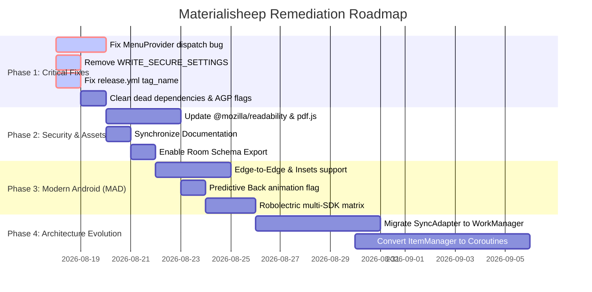

# Materialisheep Comprehensive Issues & Audit Report

This document records the exhaustive, multi-role review and adversarial **Gauntlet-Loop** audit of the `materialisheep` repository (codebase, architecture, UI/UX, security, build systems, CI/CD pipelines, test coverage, and documentation).

---

## Executive Summary & Taxonomy

### Issues by Category & Severity
| Severity | Total | Critical Breakdown |
|---|---|---|
| **Critical** | 5 | Menu dispatch failure, Settings SecurityException, Insecure/Outdated JS bundles, Uncancellable RxJava memory/CPU leaks, CI release tag corruption |
| **High** | 7 | Static mutable race conditions, Missing Edge-to-Edge insets, Missing Predictive Back, Brittle regex scraping, Robolectric API target gap |
| **Medium** | 8 | Unused `localbroadcastmanager` dependency, AGP 10 deprecation flags, Room `exportSchema=false`, Background WebView in SyncDelegate, Missing empty/error UI states |
| **Low / Tech Debt** | 8 | Monolithic God classes (`AppUtils`, `ItemActivity`), Missing Compose/M3 dynamic color, Incomplete HN Polls/Favorites model, Deep comment squeeze |
| **Doc Sync Errors** | 5 | `minSdk` discrepancy, Gradle/AGP/Retrofit version mismatches, `CI.md` stale SDK references, `debug.yml` trigger mismatch |

---

## 1. Functional Bugs & Runtime Logic Issues

### [CRIT-01] Fragment `MenuProvider` Migration Incomplete: Options Menu Clicks Dropped
- **Severity:** `Critical`
- **Perspective:** `Senior QA Engineer`, `Frontend / Android Engineer`
- **Impacted Files:**
  - [`BaseFragment.java`](file:///home/rahul/projects/materialisheep/app/src/main/java/io/github/sheepdestroyer/materialisheep/BaseFragment.java#L63-L85)
  - [`BaseListFragment.java`](file:///home/rahul/projects/materialisheep/app/src/main/java/io/github/sheepdestroyer/materialisheep/BaseListFragment.java#L129-L138)
  - [`ItemFragment.java`](file:///home/rahul/projects/materialisheep/app/src/main/java/io/github/sheepdestroyer/materialisheep/ItemFragment.java#L199-L208)
  - [`FavoriteFragment.java`](file:///home/rahul/projects/materialisheep/app/src/main/java/io/github/sheepdestroyer/materialisheep/FavoriteFragment.java#L161-L172)
- **Problem Statement:**
  [`BaseFragment.java`](file:///home/rahul/projects/materialisheep/app/src/main/java/io/github/sheepdestroyer/materialisheep/BaseFragment.java) registers a modern `MenuProvider` which delegates menu clicks to `BaseFragment.this.onMenuItemSelected(MenuItem)`. However, child fragments override the deprecated `onOptionsItemSelected(MenuItem)` instead of `onMenuItemSelected(MenuItem)`:
  ```java
  // BaseListFragment.java:131
  @SuppressWarnings("deprecation")
  @Override
  public boolean onOptionsItemSelected(MenuItem item) {
      if (item.getItemId() == R.id.menu_list) {
          showPreferences();
          return true;
      }
      return super.onOptionsItemSelected(item);
  }
  ```
- **Impact:**
  When `MenuProvider` intercepts the menu item click, it invokes `BaseFragment.onMenuItemSelected(item)` (which returns `false`). The child fragment's `onOptionsItemSelected` is never called, silently dropping display preference dialogs in story lists, comments, and favorites.
- **Remediation:**
  Change child fragment methods to `@Override public boolean onMenuItemSelected(MenuItem item)` and remove all deprecated `setHasOptionsMenu(true)` calls.

---

### [CRIT-02] `SettingsActivity` Declares System Permission `WRITE_SECURE_SETTINGS`
- **Severity:** `Critical`
- **Perspective:** `Frontend / Android Engineer`, `Senior Engineer`
- **Impacted Files:**
  - [`AndroidManifest.xml`](file:///home/rahul/projects/materialisheep/app/src/main/AndroidManifest.xml#L172-L180)
- **Problem Statement:**
  In [`AndroidManifest.xml`](file:///home/rahul/projects/materialisheep/app/src/main/AndroidManifest.xml#L174):
  ```xml
  <activity
      android:name=".SettingsActivity"
      android:label="@string/action_settings"
      android:permission="android.permission.WRITE_SECURE_SETTINGS"
      android:exported="true">
      <intent-filter>
          <action android:name="android.intent.action.APPLICATION_PREFERENCES" />
          <category android:name="android.intent.category.DEFAULT" />
      </intent-filter>
  </activity>
  ```
- **Impact:**
  `android.permission.WRITE_SECURE_SETTINGS` is a signature-level Android platform permission. Third-party launcher apps, accessibility services, or system search shortcuts attempting to launch the app's preferences via `APPLICATION_PREFERENCES` will crash with a `SecurityException`.
- **Remediation:**
  Remove `android:permission="android.permission.WRITE_SECURE_SETTINGS"` from the `<activity>` tag in [`AndroidManifest.xml`](file:///home/rahul/projects/materialisheep/app/src/main/AndroidManifest.xml).

---

### [CRIT-03] Uncancellable RxJava Subscriptions & Missing `Disposable` Lifecycle Management
- **Severity:** `Critical`
- **Perspective:** `Senior Engineer`, `Engineering Manager`
- **Impacted Files:**
  - [`HackerNewsClient.java`](file:///home/rahul/projects/materialisheep/app/src/main/java/io/github/sheepdestroyer/materialisheep/data/HackerNewsClient.java#L86-L200)
  - [`AlgoliaClient.java`](file:///home/rahul/projects/materialisheep/app/src/main/java/io/github/sheepdestroyer/materialisheep/data/AlgoliaClient.java#L74-L88)
  - [`UserServicesClient.java`](file:///home/rahul/projects/materialisheep/app/src/main/java/io/github/sheepdestroyer/materialisheep/accounts/UserServicesClient.java#L115-L210)
  - [`AdBlocker.java`](file:///home/rahul/projects/materialisheep/app/src/main/java/io/github/sheepdestroyer/materialisheep/AdBlocker.java#L53-L59)
- **Problem Statement:**
  Methods such as `HackerNewsClient.getStories`, `getItem`, `getItems`, and `AlgoliaClient.getStories` subscribe to RxJava Observables with `@SuppressLint("CheckResult")` and do not return `Disposable` references.
- **Impact:**
  When a user rapidly switches tabs, navigates backward, or exits activities, active network calls and RxJava thread pools (`Schedulers.io()`) continue executing in the background. While `WeakReference` in UI listeners avoids direct context memory leaks, ongoing deserialization and network I/O drain battery and bandwidth.
- **Remediation:**
  Migrate `ItemManager` methods to suspend functions with Kotlin Coroutines or refactor methods to return `Disposable` managed by `viewModelScope` / `CompositeDisposable`.

---

### [HIGH-01] Non-Thread-Safe Global State & Singletons
- **Severity:** `High`
- **Perspective:** `Senior Engineer`
- **Impacted Files:**
  - [`FontCache.java`](file:///home/rahul/projects/materialisheep/app/src/main/java/io/github/sheepdestroyer/materialisheep/FontCache.java#L27-L62)
  - [`AlgoliaClient.java`](file:///home/rahul/projects/materialisheep/app/src/main/java/io/github/sheepdestroyer/materialisheep/data/AlgoliaClient.java#L46)
  - [`Preferences.java`](file:///home/rahul/projects/materialisheep/app/src/main/java/io/github/sheepdestroyer/materialisheep/Preferences.java#L756-L801)
- **Problem Statement:**
  1. [`FontCache.java`](file:///home/rahul/projects/materialisheep/app/src/main/java/io/github/sheepdestroyer/materialisheep/FontCache.java): `getInstance()` is not synchronized; `ArrayMap` is accessed without locking across UI and worker threads.
  2. [`AlgoliaClient.java`](file:///home/rahul/projects/materialisheep/app/src/main/java/io/github/sheepdestroyer/materialisheep/data/AlgoliaClient.java): `public static boolean sSortByTime = true;` is mutable static state across all instances.
  3. [`Preferences.java`](file:///home/rahul/projects/materialisheep/app/src/main/java/io/github/sheepdestroyer/materialisheep/Preferences.java): `CONTEXT_KEYS` static set in `Preferences.Observable` is lazily populated without synchronization.
- **Impact:**
  Potential `ConcurrentModificationException`, font loading race conditions, and corrupted search ordering across concurrent background operations.
- **Remediation:**
  Use thread-safe data structures (`ConcurrentHashMap`, immutable sets) and eliminate static mutable flags in favor of dependency-injected configuration.

---

### [HIGH-02] Brittle HTML Screen-Scraping for Authentication & Voting
- **Severity:** `High`
- **Perspective:** `Web Researcher`, `Product Manager`, `Senior Engineer`
- **Impacted Files:**
  - [`UserServicesClient.java`](file:///home/rahul/projects/materialisheep/app/src/main/java/io/github/sheepdestroyer/materialisheep/accounts/UserServicesClient.java#L73-L90)
- **Problem Statement:**
  [`UserServicesClient.java`](file:///home/rahul/projects/materialisheep/app/src/main/java/io/github/sheepdestroyer/materialisheep/accounts/UserServicesClient.java) uses regex pattern matchers (`PATTERN_INPUT`, `PATTERN_VALUE`, `PATTERN_CREATE_ERROR_BODY`) to parse HTML form fields (`fnid`, `fnop`) from `news.ycombinator.com/login` and `news.ycombinator.com/submit`.
- **Impact:**
  Any change to Hacker News's HTML layout, CSRF handling, or addition of 2FA/Passkeys causes login and submission to fail silently or report cryptic HTTP errors.
- **Remediation:**
  Implement robust HTML DOM parsing (e.g. `Jsoup` or structured fallback) and provide clear user-facing error prompts when 2FA or CAPTCHA is detected.

---

## 2. Modern Android Development (MAD) & Platform Compliance

### [CRIT-04] Outdated Embedded JavaScript Assets (`pdf.js` & `Readability.js`)
- **Severity:** `Critical`
- **Perspective:** `Web Researcher`, `Senior Engineer`
- **Impacted Files:**
  - [`app/src/main/assets/Readability.js`](file:///home/rahul/projects/materialisheep/app/src/main/assets/Readability.js)
  - [`app/src/main/assets/pdf/vendor/pdf.js/1.9.658/`](file:///home/rahul/projects/materialisheep/app/src/main/assets/pdf/vendor/pdf.js)
- **Problem Statement:**
  1. `Readability.js` in assets is based on Arc90's v1.7.1 script from Google Code (circa 2010–2015), pre-dating modern HTML5 elements, `<article>` semantics, Shadow DOM, and responsive web structures.
  2. `pdf.js` is bundled at version `1.9.658` (circa 2017).
- **Impact:**
  Modern web articles fail readability extraction (returning empty or malformed text), and complex PDFs fail to render or experience font corruption.
- **Remediation:**
  Update to `@mozilla/readability` v0.5.x and update `pdf.js` to a modern LTS release.

---

### [HIGH-03] Missing Android 13–16 Predictive Back Support
- **Severity:** `High`
- **Perspective:** `Frontend / Android Engineer`, `UI/UX Designer`
- **Impacted Files:**
  - [`AndroidManifest.xml`](file:///home/rahul/projects/materialisheep/app/src/main/AndroidManifest.xml)
- **Problem Statement:**
  [`AndroidManifest.xml`](file:///home/rahul/projects/materialisheep/app/src/main/AndroidManifest.xml) lacks `android:enableOnBackInvokedCallback="true"`.
- **Impact:**
  The app cannot participate in Android 14+ Predictive Back system animations, causing jarring window transitions when navigating between stories and comments.
- **Remediation:**
  Add `android:enableOnBackInvokedCallback="true"` to `<application>` in [`AndroidManifest.xml`](file:///home/rahul/projects/materialisheep/app/src/main/AndroidManifest.xml).

---

### [HIGH-04] Android 15 Edge-to-Edge System Bar Inset Clashing
- **Severity:** `High`
- **Perspective:** `UI/UX Designer`, `Frontend / Android Engineer`
- **Impacted Files:**
  - [`ThemedActivity.java`](file:///home/rahul/projects/materialisheep/app/src/main/java/io/github/sheepdestroyer/materialisheep/ThemedActivity.java)
  - [`ItemActivity.java`](file:///home/rahul/projects/materialisheep/app/src/main/java/io/github/sheepdestroyer/materialisheep/ItemActivity.java)
  - [`ListActivity.java`](file:///home/rahul/projects/materialisheep/app/src/main/java/io/github/sheepdestroyer/materialisheep/ListActivity.java)
- **Problem Statement:**
  Android 15 (API 35) enforces edge-to-edge rendering by default. The app manually sets status bar colors and does not consistently apply `WindowInsetsCompat` on bottom containers and Floating Action Buttons.
- **Impact:**
  On Android 15/16 devices, FABs and bottom list items are partially hidden beneath the three-button navigation bar or gesture pill.
- **Remediation:**
  Adopt `androidx.activity.enableEdgeToEdge()` and apply `ViewCompat.setOnApplyWindowInsetsListener` to pad list bottom margins.

---

### [MED-01] Deprecated SyncAdapter Framework & Background Restrictions
- **Severity:** `Medium`
- **Perspective:** `Senior Engineer`, `Engineering Manager`
- **Impacted Files:**
  - [`SyncContentProvider.java`](file:///home/rahul/projects/materialisheep/app/src/main/java/io/github/sheepdestroyer/materialisheep/data/SyncContentProvider.java)
  - [`ItemSyncService.java`](file:///home/rahul/projects/materialisheep/app/src/main/java/io/github/sheepdestroyer/materialisheep/data/ItemSyncService.java)
  - [`SyncDelegate.java`](file:///home/rahul/projects/materialisheep/app/src/main/java/io/github/sheepdestroyer/materialisheep/data/SyncDelegate.java#L98)
- **Problem Statement:**
  The app retains legacy `SyncAdapter` scaffolding (`SyncContentProvider`, `ItemSyncService`, `READ_SYNC_SETTINGS`, `WRITE_SYNC_SETTINGS`) alongside `ItemSyncJobService`. In [`SyncDelegate.java`](file:///home/rahul/projects/materialisheep/app/src/main/java/io/github/sheepdestroyer/materialisheep/data/SyncDelegate.java#L98), a `CacheableWebView` is instantiated on the main looper during background sync.
- **Impact:**
  `SyncAdapter` is legacy technology deprecated on modern Android. Running WebViews in background services is restricted by Android battery optimization and can lead to silent termination.
- **Remediation:**
  Deprecate `ItemSyncService` in favor of `WorkManager` for background story caching and remove `SyncContentProvider`.

---

### [MED-02] Room Database Schema Export Disabled
- **Severity:** `Medium`
- **Perspective:** `Senior Engineer`
- **Impacted Files:**
  - [`MaterialisticDatabase.java`](file:///home/rahul/projects/materialisheep/app/src/main/java/io/github/sheepdestroyer/materialisheep/data/MaterialisticDatabase.java#L33)
- **Problem Statement:**
  `@Database(..., exportSchema = false)` disables Room schema JSON generation.
- **Impact:**
  Schema migrations cannot be automatically verified by Room migration tests during compilation, increasing risk of SQLite migration crashes on app upgrades.
- **Remediation:**
  Set `exportSchema = true` and configure `room.schemaLocation` in `app/build.gradle`.

---

## 3. Build System & CI/CD Pipeline Deficiencies

### [CRIT-05] GitHub Actions Release Tag Overwrite in `release.yml`
- **Severity:** `Critical`
- **Perspective:** `Engineering Manager`, `Senior QA Engineer`
- **Impacted Files:**
  - [`.github/workflows/release.yml`](file:///home/rahul/projects/materialisheep/.github/workflows/release.yml#L48-L51)
- **Problem Statement:**
  [`release.yml`](file:///home/rahul/projects/materialisheep/.github/workflows/release.yml) triggers on `push: tags: - 'v*'`, but hardcodes the release tag name:
  ```yaml
  tag_name: v3.4.${{ github.run_number }}
  name: Release v3.4.${{ github.run_number }}
  ```
- **Impact:**
  If a developer pushes tag `v3.3.1`, the workflow ignores the pushed tag and publishes a release named `v3.4.<run_number>`, breaking semantic versioning.
- **Remediation:**
  Change `tag_name` to `${{ github.ref_name }}`.

---

### [MED-03] Deprecated AGP Flags Blocking AGP 10 Migration
- **Severity:** `Medium`
- **Perspective:** `Engineering Manager`, `Frontend / Android Engineer`
- **Impacted Files:**
  - [`gradle.properties`](file:///home/rahul/projects/materialisheep/gradle.properties#L3-L4)
  - [`app/build.gradle`](file:///home/rahul/projects/materialisheep/app/build.gradle#L1-L4)
- **Problem Statement:**
  [`gradle.properties`](file:///home/rahul/projects/materialisheep/gradle.properties) includes:
  ```properties
  android.newDsl=false
  android.builtInKotlin=false
  ```
  And [`app/build.gradle`](file:///home/rahul/projects/materialisheep/app/build.gradle) applies `kotlin-android` alongside AGP 9.2.1.
- **Impact:**
  Generates build deprecation warnings on every Gradle run and will cause build failure upon upgrading to AGP 10.0.
- **Remediation:**
  Migrate to AGP built-in Kotlin support and remove deprecated properties.

---

### [MED-04] Dead Dependency: `androidx.localbroadcastmanager`
- **Severity:** `Medium`
- **Perspective:** `Engineering Manager`
- **Impacted Files:**
  - [`app/build.gradle`](file:///home/rahul/projects/materialisheep/app/build.gradle#L102)
- **Problem Statement:**
  `implementation 'androidx.localbroadcastmanager:localbroadcastmanager:1.1.0'` is included in `app/build.gradle`, but has zero usages across all source files.
- **Impact:**
  Unnecessary dependency in binary APK and classpath.
- **Remediation:**
  Remove dependency from [`app/build.gradle`](file:///home/rahul/projects/materialisheep/app/build.gradle).

---

## 4. Test Strategy & Quality Assurance Gaps

### [HIGH-05] Robolectric Tests Pinned Only to Android 12 (API 31)
- **Severity:** `High`
- **Perspective:** `Senior QA Engineer`
- **Impacted Files:**
  - [`app/src/test/java/io/github/sheepdestroyer/materialisheep/`](file:///home/rahul/projects/materialisheep/app/src/test/java/io/github/sheepdestroyer/materialisheep/)
- **Problem Statement:**
  Unit tests run under Robolectric with `@Config(sdk = Build.VERSION_CODES.S)` (API 31).
- **Impact:**
  No automated tests run against API 34 (Android 14), API 35 (Android 15), or API 36 (Android 16), leaving platform behavior changes untested.
- **Remediation:**
  Configure Robolectric test suite to test across multiple SDK targets: `sdk = {Build.VERSION_CODES.S, Build.VERSION_CODES.UPSIDE_DOWN_CAKE, Build.VERSION_CODES.VANILLA_ICE_CREAM}`.

---

### [HIGH-06] Zero Android Instrumentation / UI Tests (`androidTest`)
- **Severity:** `High`
- **Perspective:** `Senior QA Engineer`
- **Impacted Files:**
  - `app/src/androidTest/` (missing or empty)
- **Problem Statement:**
  The repository contains zero instrumentation / Espresso / UI tests.
- **Impact:**
  End-to-end user journeys (login, comment navigation, offline caching, widget updates) cannot be verified in an automated test pipeline against a real emulator or device.
- **Remediation:**
  Add a core suite of Espresso UI tests in `app/src/androidTest` covering story browsing, item opening, and comment thread collapsing.

---

## 5. UI/UX Design & Usability Issues

### [MED-05] Deep Comment Squeeze on Mobile Screens
- **Severity:** `Medium`
- **Perspective:** `UI/UX Designer`, `Product Manager`
- **Impacted Files:**
  - [`item_comment.xml`](file:///home/rahul/projects/materialisheep/app/src/main/res/layout/item_comment.xml)
  - [`ItemFragment.java`](file:///home/rahul/projects/materialisheep/app/src/main/java/io/github/sheepdestroyer/materialisheep/ItemFragment.java)
- **Problem Statement:**
  Nested comments apply fixed left margin multipliers per indentation level. On threads nested >5 levels deep, comment text is squeezed into a narrow column of 1-2 words per line.
- **Impact:**
  Severely degrades readability on deep Hacker News discussions.
- **Remediation:**
  Implement indentation clamping (max 4-5 indent levels) with visual depth color stripes or tap-to-focus thread view.

---

### [LOW-01] Missing Material You Dynamic Theming (Monet)
- **Severity:** `Low`
- **Perspective:** `UI/UX Designer`
- **Impacted Files:**
  - [`app/src/main/res/values/styles.xml`](file:///home/rahul/projects/materialisheep/app/src/main/res/values/styles.xml)
  - [`ThemePreference.java`](file:///home/rahul/projects/materialisheep/app/src/main/java/io/github/sheepdestroyer/materialisheep/preference/ThemePreference.java)
- **Problem Statement:**
  The theming system uses static XML styles and hardcoded color values.
- **Impact:**
  The app lacks Material 3 dynamic color theming based on Android 12+ wallpaper colors.
- **Remediation:**
  Add a "Dynamic System Color" option leveraging `DynamicColors.applyToActivitiesIfAvailable()`.

---

## 6. Documentation Synchronization Discrepancies

### [DOC-01] `PROJECT_KNOWLEDGE.md` Version & SDK Inconsistencies
- **Severity:** `Doc Sync`
- **Perspective:** `Web Researcher`, `Engineering Manager`
- **Impacted Files:**
  - [`PROJECT_KNOWLEDGE.md`](file:///home/rahul/projects/materialisheep/PROJECT_KNOWLEDGE.md#L13-L21)
- **Discrepancies:**
  - Claims `Minimum SDK: 30` -> Actual in `app/build.gradle` is `31`.
  - Claims `Gradle 9.2.1, AGP 8.9.1` -> Actual is `Gradle 9.5.1, AGP 9.2.1`.
  - Claims `Retrofit 2` -> Actual in `app/build.gradle` is `Retrofit 3.0.0`.
  - References legacy `ItemSyncService` as active sync service -> Fork uses `ItemSyncJobService`.

---

### [DOC-02] `CI.md` Stale Android SDK Target
- **Severity:** `Doc Sync`
- **Perspective:** `Senior QA Engineer`
- **Impacted Files:**
  - [`CI.md`](file:///home/rahul/projects/materialisheep/CI.md#L26)
- **Discrepancy:**
  - Claims Release workflow sets up Android SDK API 33 -> Actual workflow uses `android-actions/setup-android@v4` on API 36.

---

### [DOC-03] `AGENTS.md` vs `debug.yml` Workflow Trigger
- **Severity:** `Doc Sync`
- **Perspective:** `Engineering Manager`
- **Impacted Files:**
  - [`AGENTS.md`](file:///home/rahul/projects/materialisheep/AGENTS.md#L107)
  - [`.github/workflows/debug.yml`](file:///home/rahul/projects/materialisheep/.github/workflows/debug.yml#L3-L5)
- **Discrepancy:**
  - `AGENTS.md` states `debug.yml` generates debug APK on each merge to master -> `debug.yml` is configured with `on: workflow_dispatch:` only.

---

### [DOC-04] `TODO.md` Out-of-Sync Completion Status
- **Severity:** `Doc Sync`
- **Perspective:** `Product Manager`
- **Impacted Files:**
  - [`TODO.md`](file:///home/rahul/projects/materialisheep/TODO.md#L11)
- **Discrepancy:**
  - Marks `Replace setHasOptionsMenu/onOptionsItemSelected with MenuProvider` as completed `[x]`, while `BaseListFragment`, `ItemFragment`, and `FavoriteFragment` still override deprecated `onOptionsItemSelected`.

---

## 7. Recommended Prioritized Remediation Roadmap


